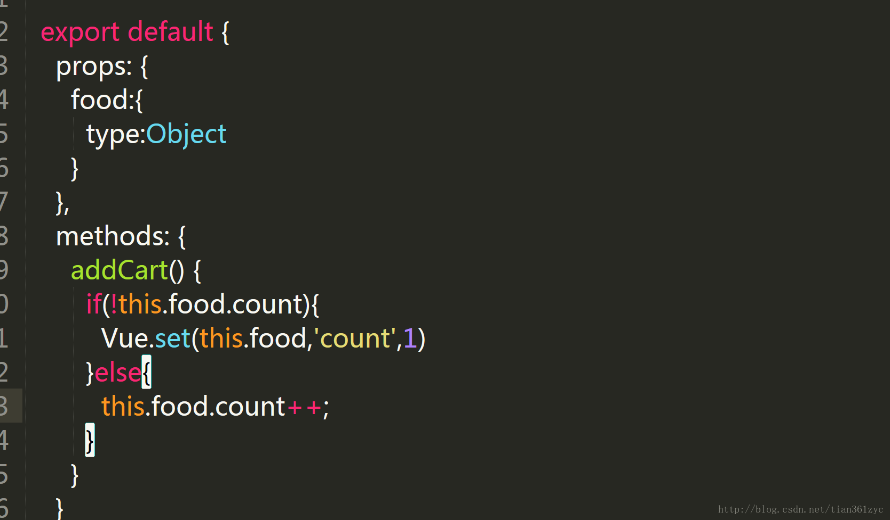

# 模板语法

### 1.插值

- 文本
	
		

			
{{ message }}

		

	
- Html

		

		    

		

		
		
- 属性

		

	  		<label for="r1">修改颜色</label><input type="checkbox" v-model="class1" id="r1">
		  	  
		  	

				directiva v-bind:class
		  	

		

		    
		

- 表达式

		

	  		{{5+5}} 
		  	{{ ok ? 'YES' : 'NO' }} 
		  	{{ message.split('').reverse().join('') }}
		  	
菜鸟教程

		

		

- 指令

		// 这里， v-if 指令将根据表达式 seen 的值(true 或 false )来决定是否插入 p 元素。
		
		

    		
现在你看到我了

		

		    
		
		
- 参数

		// 在这里 href 是参数，告知 v-bind 指令将该元素的 href 属性与表达式 url 的值绑定。
		
		

    		<pre><a v-bind:href="url">菜鸟教程</a></pre>
		

		    
		
		
		<a v-on:click="doSomething">

- 修饰符
		
		// 修饰符是以半角句号 . 指明的特殊后缀，用于指出一个指定应该以特殊方式绑定。例如，.prevent 修饰符告诉 v-on 指令对于触发的事件调用 event.preventDefault()
		
		<form v-on:submit.prevent="onSubmit"></form>

- 用户输入

		// 在 input 输入框中我们可以使用 v-model 指令来实现双向数据绑定 
		// 按钮的事件我们可以使用 v-on 监听事件，并对用户的输入进行响应。
		
		

		    
{{ message }}

		    <input v-model="message">
		

		

- 字符串反转

		

		    
{{ message }}

		    <button v-on:click="reverseMessage">反转字符串</button>
		

		

- 过滤器

		<!-- 在两个大括号中 -->
		{{ message | capitalize }}
		
		<!-- 在 v-bind 指令中 -->
		

		

		  	{{ message | capitalize }}
		

		    
		

	- 过滤器可以串联：

			{{ message | filterA | filterB }}
	- 过滤器是 JavaScript 函数，因此可以接受参数：

			{{ message | filterA('arg1', arg2) }}
			
	- 这里，message 是第一个参数，字符串 'arg1' 将传给过滤器作为第二个参数， arg2 表达式的值将被求值然后传给过滤器作为第三个参数。

- 缩写
	
	- v-bind 缩写

			<!-- 完整语法 -->
			
			<!-- 缩写 -->
			
	- 	v-bind 缩写

			<!-- 完整语法 -->
			
			<!-- 缩写 -->
			

- 新增对象属性

		Vue.set 
	
	

